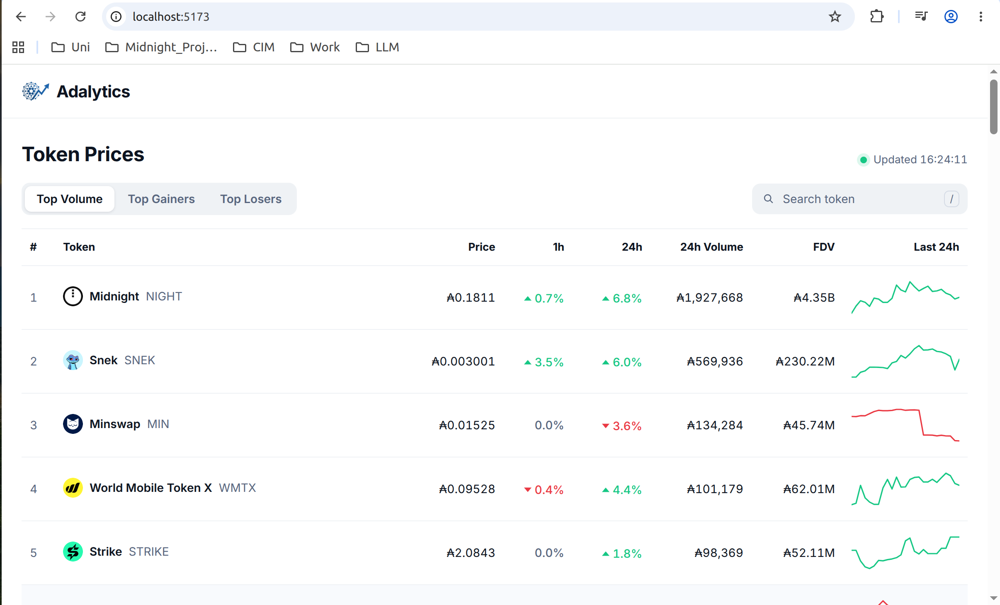
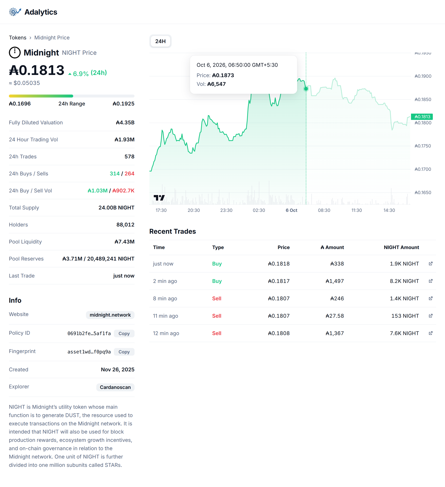
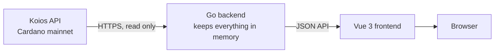
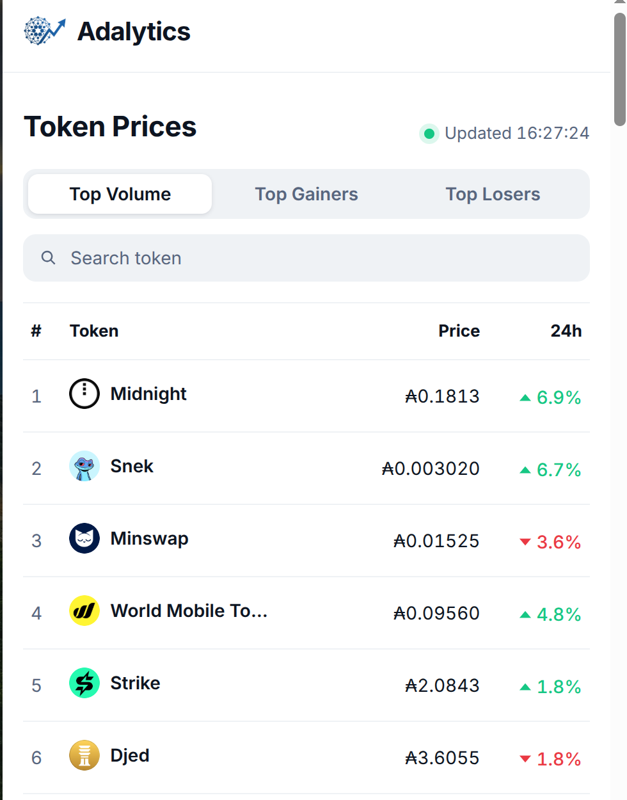

# Adalytics

**A Cardano token analytics platform.** Adalytics shows live prices, price charts and trading activity for Cardano native tokens, in the style of CoinGecko. Every number comes straight from the Cardano blockchain through the [Koios API](https://www.koios.rest).



## What it does

Adalytics tracks the 360 tokens that Minswap marks as verified and lists every one whose Minswap pool holds at least ₳10,000 (about 75 tokens on a normal day). Prices are in ADA, with a US dollar estimate next to them.

**Token list**

* Price, 1 hour, 24 hour and 7 day change, 24 hour volume, fully diluted valuation (FDV) and a small price line for every token
* A 24h / 7d toggle: Top Gainers, Top Losers and the small lines all follow the same period
* Tokens with no trades in that period are left out of the top lists; search still finds them
* Top Volume, Top Gainers and Top Losers views
* Search by name, ticker or policy ID (press `/` to jump to the search box)
* Refreshes by itself every minute
* While the backend starts, a progress box shows the percentage loaded and each step as it happens

**Token page**

* Live price chart (TradingView Lightweight Charts) for 24 hours, 7 days or 30 days, as a line or as candles, with volume bars and a tooltip on hover
* A range that is still loading can be clicked: the chart area shows the live percentage and the chart appears when it reaches 100%
* Price in ADA and USD, low and high over the chosen range, volume, number of trades, buys against sells, holder count, pool liquidity and the time of the last trade
* Info box with the project website, policy ID and fingerprint (with copy buttons), creation date, a Cardanoscan link and the project description
* The 50 most recent trades, each with a link to the transaction on Cardanoscan

It also works on phones.



## How it works



Adalytics is **read only**. It has no database and writes nothing to disk. When the backend starts, it loads what it needs from Koios into memory; when it stops, that memory is simply gone and is rebuilt on the next start.

**Where the prices come from.** Every token on Minswap V2 has a liquidity pool: one transaction output on the blockchain that holds ADA on one side and the token on the other. The pool's datum records both amounts. The price is simply

```
price in ADA = ADA in the pool / tokens in the pool
```

Whenever someone trades, the pool output is spent and a new one is created with the new amounts. Comparing one pool state with the next shows what happened:

* ADA went in and tokens came out: a **buy**
* tokens went in and ADA came out: a **sell**
* the pool's LP supply changed: someone added or removed liquidity, which is not counted as a trade
* changes under ₳1 are rounding dust and are ignored

**US dollar price.** Koios has no USD prices, so Adalytics uses the USDM stablecoin pool on Minswap: if 1 USDM costs ₳3.70, then ₳1 is worth about $0.27.

**What happens at startup**

1. List every Minswap transaction of the last 24 hours (`address_txs`) and read them in batches of 50 (`tx_info`) to build the price history, volume and trade list
2. Find the pools of the tokens that did not trade in those 24 hours (`asset_utxos`, 30 tokens per request)
3. Load total supply, logos and project details (`asset_info`). The list is now ready
4. In the background, go back one day at a time until 30 days are loaded. The 7D and 30D charts, the 7 day change and the 7 day lines appear as soon as enough days are in
5. Count holders in the background (`asset_summary`, one token at a time)

The number of days is set with `HISTORY_DAYS` in `.env` (1 to 30, default 30). Fewer days means a lighter startup.

**What happens every minute**

1. Ask Koios whether any tracked pool output has been spent (`utxo_info`, 50 pools per request)
2. Only if one was spent, read the new transactions and update that token's price, chart and trades

## Koios usage and laptop load

Adalytics uses the free Koios tier (50,000 requests a day, 100 requests per 10 seconds) and stays well below it.

| | Measured |
|---|---|
| Requests for the first 24 hours | about 62 |
| Requests for 30 days of history | loaded once in the background; the backend log prints the exact count |
| Requests per minute after that | about 3 |
| Memory | about 25 MB with 24 hours loaded, more as older days load |
| CPU | close to 0% between the minute checks |

The backend also keeps itself inside Koios's limits: at most 90 requests per 10 seconds, request bodies under 5,120 bytes, and automatic retries when Koios is busy.

## Running it yourself

You need Go 1.22 or newer, Node.js 20 or newer, and a free Koios API token from [koios.rest](https://www.koios.rest).

**1. Settings.** Copy the example file and put your Koios token in it:

```bash
cp .env.example .env
```

**2. Backend** (starts on http://localhost:8080):

```bash
cd backend
go test ./...
go build -o adalytics . && ./adalytics
```

**3. Frontend** (in a second terminal, opens on http://localhost:5173):

```bash
cd frontend
npm install
npm run dev
```

The list fills in once the backend has finished loading.

## Project structure

```
backend/
  main.go                     starts the tracker and the web server
  internal/config/            reads settings from .env
  internal/koios/             small Koios client: rate limit, retries, request size check
  internal/minswap/           reads a Minswap V2 pool from its datum and works out the price
  internal/market/
    tokens.json               the 360 verified tokens from Minswap's token list
    tracker.go                loads history, follows new swaps, ranks tokens, builds trades
    history.go                chart ranges (24H, 7D, 30D), line points and candles
  internal/api/server.go      the JSON API used by the frontend

frontend/src/
  pages/TokenList.vue         the token list
  pages/TokenPage.vue         the token page
  components/PriceChart.vue   the price chart (line or candles)
  components/LoadingProgress.vue the live loading box
  components/RecentTrades.vue the recent trades table
  components/Sparkline.vue    the small price lines in the list
  format.js                   number formats (₳, $, %, K/M/B)
```

**API**

| Endpoint | Returns |
|---|---|
| `GET /api/tokens` | every listed token with price, changes, volume and details, plus how much history is loaded |
| `GET /api/tokens/{id}/chart?range=7D&type=candles` | chart for one token: `range` is 24H, 7D or 30D, `type` is line or candles |
| `GET /api/tokens/{id}/trades?limit=5` | the most recent trades for one token |
| `GET /api/tokens/{id}/logo` | the token's logo from the Cardano token registry |

## Current limits

* Prices come from Minswap V2 only. Tokens that mostly trade on other exchanges may show lower volume than sites that combine every exchange, such as DexHunter.
* History is kept in memory only, so after every restart the 30 days are loaded again from Koios.
* Ranking is by 24 hour volume, because circulating supply (needed for market cap) is not known for every token.
* Minswap fills orders in batches, so two people's orders in the same transaction show up as one trade.

## Built with

Go, Vue 3 (Composition API), Vite, Vue Router, TradingView Lightweight Charts, Koios API, and the Minswap verified token list.


